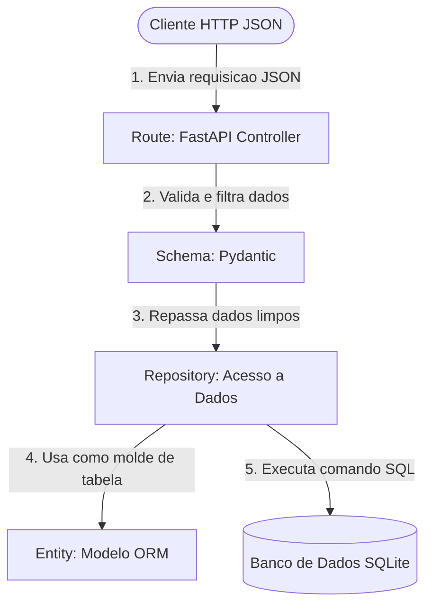

# 🚀 Desafio Bagaggio 2026 - Resolvido

> **Repositório Original do Desafio:** [Bagaggio-II / teste-estagio-2026](https://github.com/Bagaggio-II/teste-estagio-2026)

> **DEV Bernardo Cezar:** [Linkedin](www.linkedin.com/in/bernardocezaralvesdeoliveira)

---

## 🔍 Problemas Identificados

Durante a análise da API, foram encontrados pontos críticos que impactavam segurança, consistência dos dados e organização do código:

- **Exposição de dados sensíveis:** As senhas estavam sendo retornadas nas respostas da API.
- **Inconsistência na exclusão de registros:** O endpoint de `DELETE` apresentava comportamento incorreto, removendo registros diferentes do usuário solicitado devido a falhas na lógica do repositório.
- **Duplicidade de e-mails:** Não havia validação adequada para unicidade de e-mail, permitindo o cadastro de múltiplos usuários com o mesmo endereço.
- **Metadados não atualizados:** O campo `updated_at` não era atualizado corretamente nas operações de `PATCH`, não refletindo as alterações realizadas.
- **Acoplamento e Falha de Comunicação:** Parte das regras de negócio e acesso a dados estavam distribuídas entre `routes` e `main`. Além disso, o `Repository` e a `Route` não conversavam de forma clara, gerando sobreposição e duplicidade de ações operacionais espalhadas entre a rota e a entidade.

---

## 🛠️ Nova Arquitetura (Repository Pattern)

Para garantir escalabilidade e manutenção, a aplicação foi reestruturada baseada no princípio da **Separação de Responsabilidades (SoC)**. A camada de Rotas agora atua estritamente como controladora.



---

## 💻 Soluções Aplicadas e Exemplos de Código

Abaixo estão as correções implementadas para resolver os problemas mapeados, isolando as responsabilidades:

### 1. Filtro de Saída e Proteção de Dados (Pydantic)

**Solução:** Implementação de `response_model` nos endpoints. O Pydantic atua como barreira, cortando a senha antes da geração do JSON de resposta HTTP.

```python
# Route: O modelo UserResponse garante que a senha fique de fora da saída
@router.get("/{user_id}", response_model=UserResponse)
def get_user(user_id: int, db: Session = Depends(get_db)):
    user = users.get_user(db, user_id)
    if not user:
        raise HTTPException(status_code=404, detail="Usuário não existe")

    found_user = users.get_user(db=db, user_id=user_id)
    return found_user
    # ...
```

### 2. Correção da Exclusão de Registros

**Solução:** Lógica de exclusão reescrita para garantir o alvo correto, buscando a instância exata no banco de dados através da ID antes do comando de deleção.

```python
# Repository: Deleção determinística e isolada da rota
def delete_user(db: Session, user: User):
    db.delete(user)
    db.commit()
```

### 3. Trava de Unicidade de E-mail

**Solução:** Inclusão de uma etapa de verificação prévia no banco de dados. Cadastros ou atualizações com e-mails já existentes são barrados na camada de roteamento. Assim como Unique Constraint em `Entities`.

```python
# Route: Validação de negócio executada antes de acionar o repositório
users_email = users.get_user_by_email(db, email=payload.email)
if users_email:
    raise HTTPException(status_code=400, detail="Email já existente")
```

```python
email: Mapped[str] = mapped_column(String(255), unique=True, nullable=False, index=True)
```

### 4. Atualização Reativa de Metadados (`updated_at`)

**Solução:** A responsabilidade de atualizar a data foi repassada para o motor do banco de dados (SQLAlchemy), utilizando o gatilho `onupdate`.

```python
# Entity: O parâmetro onupdate garante a automação temporal da coluna
class User(Base):
    __tablename__ = "users"
    # ...
    updated_at = Column(DateTime, default=datetime.utcnow, onupdate=datetime.utcnow)
```

### 5. Isolamento de Responsabilidades (Route vs Repository)

**Solução:** Eliminação da duplicidade de ações. `Route` passou a lidar exclusivamente com o protocolo HTTP, delegando a persistência de dados de forma genérica e dinâmica para o repositório via `setattr`.

```python
# Repository: Atualização limpa de qualquer campo sem duplicar lógicas de 'if'
def update_user(db: Session, user: User, update_data: dict) -> User:
    for key, value in update_data.items():
        setattr(user, key, value)
    db.commit()
    db.refresh(user)
    return user
```

```python
def update_user(
    db: Session,
    user: User,
    update_data: dict
) -> User:
    for key, value in update_data.items():
        setattr(user, key, value)

    db.commit()
    db.refresh(user)
    return user
```

---

## 🧹 Faxina de Código Legado (Clean Code)

- **Limpeza do `main.py`:** Remoção de código morto, rotas de debug (`/debug/users-count`) e da função `buscar_usuario_na_main` que causava vazamento de conexões abertas no banco.
- **Substituição de Helpers:** A função legada de `erro()` foi removida, padronizando os retornos da API com o `HTTPException` oficial do framework.
- **Otimização de Imports:** Remoção de importações desnecessárias em arquivos centrais.

---

## 🔮 Roadmap de Evolução e Segurança

1. **Soft Delete (Exclusão Lógica):** Alterar o `db.delete()` para uma atualização de status (`is_active = False`), retendo os dados para consultas de auditoria corporativa.
2. **Hash de Senhas:** Implementar a biblioteca `passlib` (Bcrypt) para garantir que as senhas fiquem irreconhecíveis na base de dados, prevenindo exposição em caso de vazamento.
3. **Testes Automatizados:** Criação de rotinas com `pytest` e `TestClient` para garantir a integridade técnica dos endpoints a cada nova atualização.

---

## 🚀 Como Executar Localmente

**1. Clonar o repositório:**

```bash
git clone https://github.com/Bagaggio-II/teste-estagio-2026.git
cd teste-estagio-2026
```

**2. Criar e ativar o ambiente virtual:**

```bash
python -m venv .venv

# No Windows (PowerShell)
.\.venv\Scripts\Activate.ps1

# No Linux ou macOS
source .venv/bin/activate
```

**3. Instalar as dependências:**

```bash
pip install -r requirements.txt
```

**4. Iniciar o banco e o servidor:**

```bash
# Caso possua dados iniciais:
python seed.py

uvicorn main:app --reload
```

Acesse a documentação interativa (Swagger UI) em: `http://127.0.0.1:8000/api/users/docs`.
