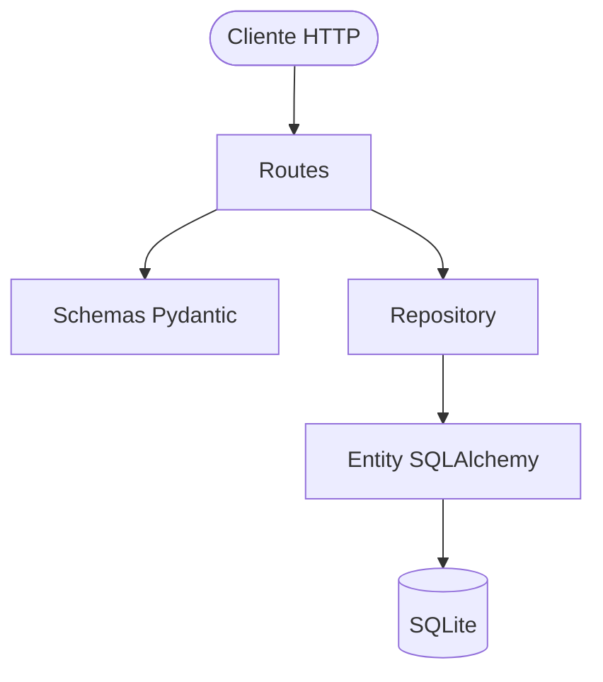

# 🚀 Desafio Bagaggio 2026 - Resolvido

> **Repositório Original do Desafio:** [Bagaggio-II / teste-estagio-2026](https://github.com/Bagaggio-II/teste-estagio-2026)

> **Desenvolvido por Bernardo Cezar:** [LinkedIn](https://www.linkedin.com/in/bernardocezaralvesdeoliveira)

---

# 📖 Sobre o Projeto

Este repositório contém minha solução para o desafio técnico proposto pela Bagaggio.

O objetivo não foi reescrever a aplicação do zero, mas assumir uma base de código existente, compreender sua estrutura, identificar oportunidades de melhoria e evoluí-la de forma incremental, preservando seu funcionamento enquanto aumentava sua segurança, organização e facilidade de manutenção.

---

# 🔍 Processo de Análise

Antes de realizar qualquer alteração, executei a aplicação e revisei sua estrutura para compreender o fluxo entre rotas, entidades e persistência dos dados.

A partir dessa análise, identifiquei oportunidades de melhoria relacionadas à:

* Segurança;
* Consistência dos dados;
* Organização da arquitetura;
* Separação de responsabilidades;
* Manutenibilidade do código.

As alterações foram realizadas de forma incremental, preservando a estrutura original da aplicação sempre que possível, conforme proposto pelo desafio.

---

# 🔎 Problemas Identificados

Durante a análise da API, foram encontrados pontos que impactavam segurança, consistência dos dados e manutenção da aplicação.

* **Exposição de dados sensíveis:** As senhas eram retornadas nas respostas da API.
* **Inconsistência na exclusão de registros:** O endpoint `DELETE` apresentava comportamento incorreto devido à lógica utilizada no repositório.
* **Duplicidade de e-mails:** Não existia validação para impedir o cadastro de usuários utilizando o mesmo endereço de e-mail.
* **Atualização incompleta de metadados:** O campo `updated_at` não era atualizado automaticamente nas operações de `PATCH`.
* **Responsabilidades distribuídas:** Parte da lógica de persistência encontrava-se misturada às rotas, dificultando manutenção, reutilização de código e evolução da aplicação.

---

# 🛠️ Reorganização da Arquitetura

A aplicação foi reorganizada seguindo o princípio da **Separação de Responsabilidades (Separation of Concerns - SoC)**.

Com isso:

* As **Rotas (Routes)** passaram a tratar exclusivamente das requisições e respostas HTTP;
* Os **Schemas (Pydantic)** ficaram responsáveis pela validação dos dados de entrada e saída;
* O **Repository** passou a centralizar todo o acesso ao banco de dados;
* As **Entities (SQLAlchemy)** permaneceram representando as tabelas da aplicação.



---

# 💻 Soluções Aplicadas

A seguir estão as principais melhorias implementadas durante a evolução da aplicação.

## 1. Proteção de Dados Sensíveis

**Solução:** Implementação do `response_model` nos endpoints para que o Pydantic filtre automaticamente os campos retornados ao cliente, impedindo que a senha seja exposta.

```python
@router.get("/{user_id}", response_model=UserResponse)
def get_user(user_id: int, db: Session = Depends(get_db)):
    user = users.get_user(db, user_id)

    if not user:
        raise HTTPException(status_code=404, detail="Usuário não existe")

    return user
```

---

## 2. Correção da Exclusão de Registros

**Solução:** A lógica de exclusão foi simplificada para remover exclusivamente a entidade previamente recuperada do banco de dados.

```python
def delete_user(db: Session, user: User):
    db.delete(user)
    db.commit()
```

---

## 3. Validação de Unicidade de E-mail

**Solução:** Foi adicionada validação antes da criação do usuário e também uma restrição de unicidade na entidade.

```python
users_email = users.get_user_by_email(db, email=payload.email)

if users_email:
    raise HTTPException(
        status_code=400,
        detail="Email já existente"
    )
```

```python
email: Mapped[str] = mapped_column(
    String(255),
    unique=True,
    nullable=False,
    index=True
)
```

---

## 4. Atualização Automática do Campo `updated_at`

**Solução:** A atualização do campo passou a ser gerenciada automaticamente pelo SQLAlchemy utilizando o parâmetro `onupdate`, eliminando a necessidade de atualizar manualmente a data.

```python
updated_at = Column(
    DateTime,
    default=datetime.utcnow,
    onupdate=datetime.utcnow
)
```

---

## 5. Separação de Responsabilidades

**Solução:** As rotas passaram a conter apenas validações relacionadas ao protocolo HTTP e regras de entrada da requisição. Toda a lógica de persistência foi concentrada na camada de repositório.

```python
def update_user(
    db: Session,
    user: User,
    update_data: dict
) -> User:

    for key, value in update_data.items():
        setattr(user, key, value)

    db.commit()
    db.refresh(user)

    return user
```

---

# 🧹 Refatoração e Limpeza do Código

Além das correções funcionais, também foram realizadas melhorias visando facilitar futuras manutenções.

* Remoção de código morto presente no `main.py`;
* Remoção da rota de depuração `/debug/users-count`;
* Remoção da função `buscar_usuario_na_main`, centralizando o acesso aos dados no repositório;
* Substituição da função legada `erro()` pelo tratamento padrão utilizando `HTTPException`;
* Organização e limpeza dos imports.

---

# 🔮 Possíveis Evoluções

Algumas melhorias foram identificadas, porém ficaram fora do escopo deste desafio.

1. Implementação de **Soft Delete**, preservando o histórico dos registros.
2. Armazenamento de senhas utilizando **Hash (Passlib + Bcrypt)**.
3. Criação de testes automatizados com **Pytest** e **FastAPI TestClient**.
4. Implementação de paginação na listagem de usuários.
5. Tratamento centralizado de exceções.
6. Logging estruturado para auditoria e monitoramento.

---

# 🚀 Como Executar Localmente

## 1. Clonar o repositório

```bash
git clone https://github.com/USER/teste-estagio-2026.git

cd teste-estagio-2026
```

> **Substitua `SEU-USUARIO` pelo nome do seu repositório no GitHub.**

---

## 2. Criar e ativar o ambiente virtual

```bash
python -m venv .venv

# Windows (PowerShell)
.\.venv\Scripts\Activate.ps1

# Linux / macOS
source .venv/bin/activate
```

---

## 3. Instalar as dependências

```bash
pip install -r requirements.txt
```

---

## 4. Inicializar o banco de dados

```bash
python database/seed.py
```

---

## 5. Executar a API

```bash
uvicorn main:app --reload
```

---

## 📄 Documentação

Após iniciar a aplicação, a documentação interativa (Swagger UI) estará disponível em:

```text
http://127.0.0.1:8000/api/users/docs
```

---
